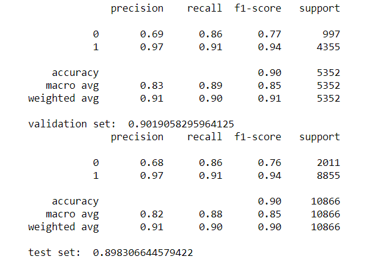

# Machine conditions monitoring

This project outcome belongs to **Daniel Mendoza** and **Gülce Padem** who are currently junior Data Scientists/AI Operators in making at BeCode's Theano 2.27 promotion.

**Repository:** motor_graders

**Type of Challenge:** Learning

**Duration:** 2 weeks

**Deadline:** 02/04/2021 09:00 AM

**Deployment strategy:** Github page

**Team challenge:** Group project

## Mission objectives

- Be able to work and process data from audio format
- Find insights from data, build hypothesis and define conclusions
- Build machine learning models for predictive classification and/or regression
- Select the right performance metrics for your model
- Evaluate the distribution of datapoints and evaluate its influence in the model
- Be able to identify underfitting or overfitting that might exist on the model
- Tuning parameters of the model for better performance
- Select the model with better performance and following your
  customer's requirements
- Define the strengths and limitations of the model

## The Mission

Acme Corporation is a worldwide supplier of technological equipment. The factory is facing significant problems with their manufacturing line, the machines are constantly facing failures due to a lack of maintenance and the production is stopped every time an unexpected failure is presented. As a result, Acme is losing millions of U.S Dollars and important clients like Wile E. Coyote are experiencing delays in deliveries.

The company has collected audio samples of equipment working on normal and anomalous conditions. Their objective is to develop a machine learning model able to monitor the operations and identify anomalies in the sound pattern.

The implementation of this model can allow Acme to operate the manufacturing equipment at full capacity and detect signs of failure before the damage is so critical that the production line has to be stopped.

Our mission is to build a machine learning model for Acme so they can continue their manufacturing activities and help the Coyote to catch the roadrunner.

### Table of Contents

- Installation
- Repository
- Visual
- Pending things to do
- Acknowledgments
- Collaboration

### Installation

For requested packages, conda package manager was used. Extra needed packages are the following (see the parantheses for the command to install with conda):

- pandas (conda install -c conda-forge pandas)
- librosa (conda install -c conda-forge librosa)
- imblearn (conda install -c conda-forge imblearn)

Jupyter Notebook was installed and launched from the Conda navigator activated in the working environment.

### Repository

There is only a **master** branch under the repository.

#### Master Branch

The structure:

- 0.Files_info
- 1.Features_and_targets
- 2.Models
- 3.Code
- Exploration_phase
- images
- .gitignore
- README.md

`0.Files_info`

In this folder it is possible to find several csv files per machine part type including information about the specifics.

`1.Features_and_targets`

In this folder it is possible to find several csv files per machine part type including features and targets extracted for the machine learning model.

`2.Models`

In this folder it is possible to find the model applied to different machine part types and to whole dataset.

`3.Code`

In this folder it is possible to find the code we have written to extract features, create a model, look for feature importances and the implementation of the model. If you would like to try the model on your data, please go to file 4.

`Exploration_phase`

This folder has all the trials and error we have encountered during the development part of our project. We like to keep it for further inspiration. Cause a project is never finished :)

`images`

In this folder you can find the visuals.

`.gitignore`

This file is to ignore the notebook checkpoints.

`README.md`

You are reading it now. It is important to read the whole file before forking or cloning.

### Visual

Our metrics of our model with the whole dataset

### Pending things to do

We believe that with further feature engineering and hyperparameter tuning, we can make a better model hence better predictions for this specific case.

We would also like to create a validation dataset with random data found on the internet to see how our model really performs.

### Acknowledgments

We would like to thank our coaches Chrysanthi Katrini and Alber Dominguez for giving us the opportunity to work on an interesting use case as this. We also would like to thank our colleagues from BeCode Theano 2.27 promotion for making every project a group effort.

### Collaboration

This project is open to collaborations as well as forking or cloning for further development.
